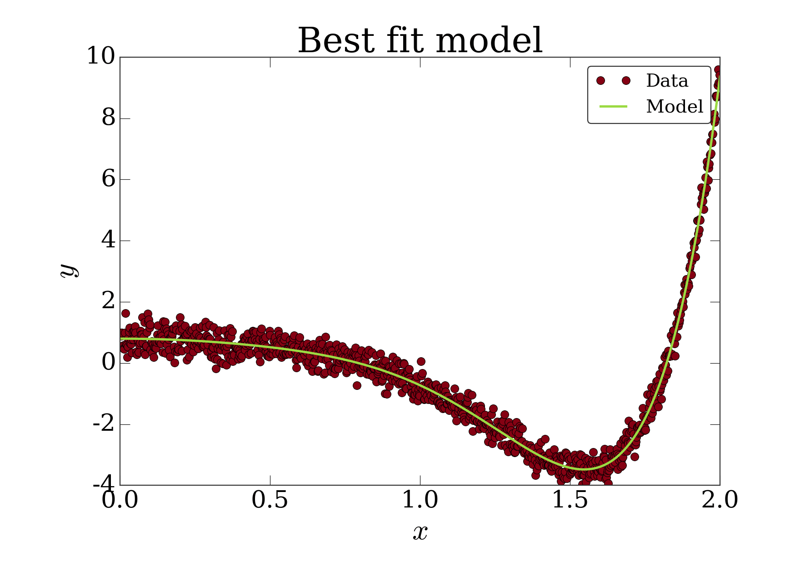
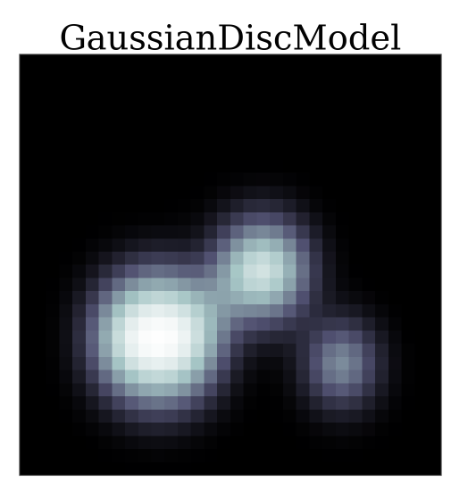
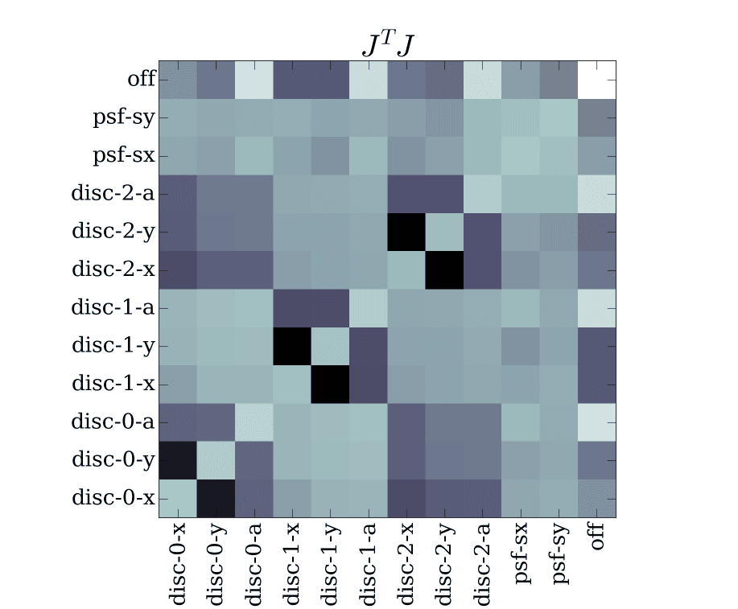

********************
Package architecture
********************

Here we describe the various abstractions used to allow great flexibility in
the ``peri`` package while also allowing for a generalized framework for
optimization image updates (frequently through local updates and caching). The
description will proceed in three stages:

1. **The State** -- We talk about the ``State`` class, its properties, and
   model updates, through an example of fitting a polynomial.
2. **The ImageState** -- We talk about the ``ImageState`` class, its
   properties, and model updates, through an example of an image of Gaussian
   discs.
3. **Optimization and Advanced Components** -- We talk about optimization of
   stage two, demonstrating the local update framework and other advanced
   components, through the optimization and model fitting of the image of
   Gaussian discs.

States (Example: PolyFitState)
==============================

In this section (with PolyFitState example), we will have noisy data which we
wish to fit with a polynomial. While a relatively simple problem, we will
implement it in the PERI framework, including how to get the best performance
using various aspects of the package.

Overview
--------

The basic structure needed to fit a model to data is the
:class:`~peri.states.State` object. This structure holds the data and model and
provides a common interface that allows the ``peri`` package to optimize a set
of parameters to match the two. All of the common operations are implemented
(including but not limited to Jacobians, Hessians, log-likelihood, priors),
leaving you to implement only a few methods in order to have a functioning
:class:`~peri.states.State`. In order to implement a
:class:`~peri.states.State`, you must know about the following class methods:

.. autoclass:: peri.states.State
    :members: data, model, update
    :undoc-members:
    :noindex:

State class
-----------

To demonstrate this ``State`` class, let's implement a polynomial fit class
which fits a one dimensional curve to an arbitrary degree polynomial.  In the
following class, we subclass :class:`~peri.states.State` and implement the
properties and functions that we outlined in the previous section. In
particular, in the ``__init__``, we store the input ``x`` points as a member
variable and ``y`` values as data. We then set up parameter names and values
depending on whether the user supplied coefficients the init. We call the
superclasses' init and call update with these parameters and values to make
sure that the model is calculated.

.. code-block:: python

    class PolyFitState(peri.states.State):
        def __init__(self, x, y, order=2, coeffs=None):
            self._data = y
            self._xpts = x
    
            params = ['c-%i' %i for i in xrange(order)]  # names for the coefficients
            values = coeffs if coeffs is not None else [0.0]*order  # and their values
    
            super(PolyFitState, self).__init__(
                params=params, values=values, ordered=False
            )
    
            self.update(self.params, self.values)

        def update(self, params, values):
            super(PolyFitState, self).update(params, values)
            self._model = np.polyval(self.values, self._xpts)
    
        @property
        def data(self):
            return self._data
    
        @property
        def model(self):
            return self._model

The ``update`` function for this class simply uses numpy's ``polyval`` function
to evaluate the parameter values as a polynomial at the stored ``x`` values.
This model value is stored as a member variable and returned for the ``model``
property. The ``data`` property is simple the stored ``y`` values.

We can then make an instance of this ``PolyFitState`` and begin to fit fake
'data' with our model.

.. code-block:: python

    # noise level
    sigma = 0.3

    # num of coefficients, datapoints
    C, N = 8, 1000

    # generate data
    np.random.seed(159)
    c = 2*np.random.rand(C) - 1
    x = np.linspace(0.0, 2.0, N)
    y = np.polyval(c, x) + sigma*np.random.randn(N)

    # create a state
    s = PolyFitState(x, y, order=C)

Properties
^^^^^^^^^^

We can check out some of the common functions provided to ``State`` objects
before we begin to optimize. For example, we can look at an approximation to
the sensitivity matrix :math:`J^T J`:

.. code-block:: python

    import matplotlib.pyplot as pl
    pl.imshow(s.JTJ(), cmap='bone')
    pl.xticks(np.arange(len(s.params)), s.params)
    pl.yticks(np.arange(len(s.params)), s.params)
    pl.title(r"$J^T J$ for PolyFitState")

.. figure:: ./_static/arch_polyfit_jtj.png
   :alt: ``pl.imshow(s.JTJ(), cmap='bone')``
   :align: center
   :scale: 40

   Showing the relatively boring structure of :math:`J^T J` for the PolyFitState.

or we can calculate the `Cramer-Rao bound
<https://en.wikipedia.org/wiki/Cram%C3%A9r%E2%80%93Rao_bound>`_ for the fit
parameters:

.. code-block:: python

    s.crb()

Optimization
^^^^^^^^^^^^

From here, we can optimize the parameters of the state along with the estimated
noise level. First, we will do so using Monte Carlo sampling, particularly with
a multidimensional slice sampler.

.. code-block:: python

    import matplotlib.pyplot as pl
    from peri.mc import sample

    # burn a number of samples if hadn't optimized yet
    #h = sample.sample_state(s, s.params, N=1000, doprint=True, procedure='uniform')

    # then collect the samples around the true value
    h = sample.sample_state(s, s.params, N=30, doprint=True, procedure='uniform')

    # distribution of fit parameter values
    h.get_histogram()

We can also optimize the ``PolyFitState`` using variations on nonlinear least
squares optimization with `Levenberg-Marquardt
<https://en.wikipedia.org/wiki/Levenberg%E2%80%93Marquardt_algorithm>`_.

.. code-block:: python

    import peri.opt.optimize as opt
    opt.do_levmarq(s, s.params[1:])

    fig = pl.figure()
    pl.plot(s._xpts, s.data, 'o', label='Data')
    pl.plot(s._xpts, s.model, '-', label='Model')
    pl.xlabel(r"$x$")
    pl.ylabel(r"$y$")
    pl.legend(loc='best')
    pl.title("Best fit model")

   Comparison of data and model fit for PolyFitState with data seeded from
   an 8th order polynomial with noise.

All the code listed above can be downloaded :download:`here <./_static/arch_polyfit.py>`.

Image states (Example: GaussianDiscModel)
=========================================

Since a common usage pattern of PERI is to optimize models of experimental
microscope images, we implemented a very flexible ``ImageState`` which
provides:

* Easy implementation of new model equations
* Compartmentalization of parts of an image
* Many optimizations including local image updates and better FFTs

On top of the :class:`~peri.states.State` class, we add several layers of
complexity.  We feel these levels of complexity help, rather than hinder, the
development of new image models and allows the flexibility to adapt to new
brands and types of microscopes and experimental systems. Here we will describe
these structures and along the way develop a very simple image model of
polydisperse discs in a plane imaged with microscope described by a Gaussian
point-spread-function (PSF). In particular, the model we will be creating is:

.. math::

    \mathcal{M}(\bvec{x}) = B(\bvec{x}) + \int P(\bvec{x} - \bvec{x}^{\prime}) S(\bvec{x}; \{\bvec{p}_i, a_i\}) \rm{d}\bvec{x}^{\prime}

where :math:`P` is the point spread function and :math:`S` is the shape
function which defines the *Platonic* solid, and :math:`B` is a spatially
varying background which may represent any number of confounding factors
in image formation. We'll start with a simple model of two-dimensional circular
discs, infludenced by microscope optics through an anisotropic Gaussian point-
spread function, and imaged on a detector with non-uniform background:

.. math::

    P(\bvec{x}) &= \frac{1}{\sqrt{4\pi^2 \sigma_x^2 \sigma_y^2}} e^{ -x^2/2\sigma_x^2 - y^2/2\sigma_y^2} \\    
    S(\bvec{x}; \{\bvec{p}_, a_i\}) &= \sum_{i=0}^{N_{\rm{particles}}}  \frac{1}{1 + e^{\alpha (\|\bvec{x} - \bvec{p}_i\| - a_i)}} \\
    B(\bvec{x}) &= \sum_{i=0}^{C_x} \sum_{j=0}^{C_y} c_{ij} L_i(x) L_j(y)

Since each of this functional form seem distinct, we separate our model into
small objects which we call ``components``. These ``components`` calculate part
of the model (:math:`P`, :math:`S`, ...) over a certain region, or ``Tile``,
then get combined back into the overall model. This philosophy can be expressed
simply as:

* **Model** (:class:`~peri.models.Model`) -- The entire equation (and derivatives) describing the image formation :math:`\mathcal{M}`
* **Component** (:class:`~peri.comp.comp.Component`) -- Small subsections of the model e.g. :math:`P`, :math:`S`, :math:`B`
* **Tile** (:class:`~peri.util.Tile`) -- Regions of the image over which parts of the model are calculated.

Model
-----

We will start our description from the top down, first describing the
``Model``, or the equation that produces our model image. To create a new model,
we simply subclass the :class:`~peri.models.Model` class and overwrite the
``__init__`` function. This function holds the actual equations which are
called to calculate the model image. For our example here, let's simply
translate the equation above:

.. code-block:: python

    import peri.models
    
    class GaussianDiscModel(peri.models.Model):
        def __init__(self):
            # gives human readable labels to equation variables
            varmap = {'P': 'psf', 'D': 'disc', 'C': 'off'}
            
            # gives the full model equation of applying the psf P to an image
            # of discs D and adding an offset because the peak-to-peak of 
            # real images is often hard to discern
            modelstr = {'full' : 'P(D) + C'}

            # calls the super-class' init
            super(GaussianDiscModel, self).__init__(
                modelstr=modelstr, varmap=varmap, registry=None
            )

As mentioned in the comments for the code segment, we first have a ``varmap``
(variable map) that essentially acts to give human labels to the variables in
the model equation. We define a psf :math:`P`, disc image :math:`D`, and
constant offset :math:`C`. The ``modelstr`` defines the actual equation (which
will be ``eval``'d) in terms of the variables defined above. In this equation,
the ``Component`` given by each label (psf, disc, off) will have their
``get()`` function called and inserted into the string. More on this later.

We are done with this section of the example. In the next example we will talk
about necessary optimizations to include to make this ``Model`` perform better.

Components
----------

The items that we listed in the model (psf, disc, off) must be a subclass of
:class:`~peri.comp.comp.Component` or
:class:`~peri.comp.comp.ComponentCollection`.  These objects are essentially a
group of parameters and values (names and numbers), knowledge of how to compute
something, and a method to update itself. They can be significantly more
complicated depending on various optimizations, but we will here demonstrate
the most basic form of a ``Component`` (we will get complicated in the next
example).

ParameterGroup
^^^^^^^^^^^^^^

At the lowest level, a ``Component`` is a ``ParameterGroup``, a storage
container for values and names associated with those values.  A
:class:`~peri.comp.comp.ParameterGroup` is a container that provides a common
interface to any object which computes "something" based on a set of
``parameters`` (string names) and ``values`` (the values associated with those
names). In the most basic form, a ``ParameterGroup`` must care about the
following structure:

.. autoclass:: peri.comp.comp.ParameterGroup
    :members: get_values, set_values, update
    :noindex:

In order to implement a ``Component``, you should be familiar with the methods
listed above.

Component
^^^^^^^^^

A subclass of the ``ParameterGroup`` is a ``Component`` which is a group of
values which are used to compute part of the model image. Therefore, its
``update()`` function must actually update the necessary parts of the
computation for that component. Additionally, the ``Components`` must know
something about the dimensions of the image over which they are expected to
function as well as the current area of interest. It must also provide
information about which parts of the image it finds important (but won't deal
with this until the next section). Therefore, in the :class:`~peri.comp.comp.Component`
class we need to know about:

.. autoclass:: peri.comp.comp.Component
    :members: initialize, get_update_tile, get_padding_size, set_tile, set_shape, get
    :noindex:

Let's sink our teeth in and create 2 of the components that will work in our
``GaussianDiscModel`` (one already available in the ``peri`` package). We will
first create something to use as the psf, then a component to use as the disc
element of the image. The offset component is already implemented in
:class:`~peri.comp.comp.GlobalScalar`.

GaussianPSF
"""""""""""

.. code-block:: python

    import peri.util
    import peri.comp.comp
    from peri.fft import fft, fftkwargs, fftnorm

    import numpy as np

    class GaussianPSF(peri.comp.comp.Component):
        def __init__(self, sigmas=(1.0, 1.0)):
            # setup the parameters and values which will be passed to super
            super(GaussianPSF, self).__init__(
                params=['psf-sx', 'psf-sy'], values=sigmas, category='psf'
            )
    
        def get(self):
            """
            Since we wish to use the GaussianPSF in the model by calling P(D), the
            get function will simply return this object and we will override
            __call__ so that we can use P(...).
            """
            return self
    
        def __call__(self, field):
            """
            Accept a field, apply the point-spread-function, and return
            the resulting image of a blurred field
            """
            # in order to avoid translations from the psf, we must create
            # real-space vectors that are zero in the corner and go positive
            # in one direction and negative on the other side of the image
            tile = peri.util.Tile(field.shape)
            rx, ry = tile.kvectors(norm=1.0/tile.shape)
    
            # get the sigmas from ourselves
            sx, sy = self.values
    
            # calculate the real-space psf from the r-vectors and sigmas
            # normalize based on the calculated values, not the usual normalization
            psf = np.exp(-((rx/sx)**2 + (ry/sy)**2)/2)
            psf = psf / psf.sum()
    
            # perform the convolution with ffts and return the result
            out = fft.fftn(fft.ifftn(field)*fft.ifftn(psf))
            return fftnorm(np.real(out))
    
        def get_padding_size(self, tile):
            # claim that the necessary padding size for the convolution is
            # the size of the padding of the image itself for now
            return peri.util.Tile(self.inner.l)
    
        def get_update_tile(self, params, values):
            # if we update the psf params, we must update the entire image
            return self.shape

PlatonicDiscs
"""""""""""""

.. code-block:: python

    import peri.util
    import peri.comp.comp
    import numpy as np

    class PlatonicDiscs(peri.comp.comp.Component):
        def __init__(self, positions, radii):
            comp = ['x', 'y', 'a']
            params, values = [], []
    
            # apply using naming scheme to the parameters associated with the
            # individual discs in the object pos and rad
            for i, (pos, rad) in enumerate(zip(positions, radii)):
                params.extend(['disc-{}-{}'.format(i, c) for c in comp])
                values.extend([pos[0], pos[1], rad])
    
            # use our super-class structure to keep track of these parameters
            self.N = len(positions)
            super(PlatonicDiscs, self).__init__(
                params=params, values=values, category='disc',
            )
    
        def draw_disc(self, rvec, i):
            # get the position and radii parameters cooresponding to this particle
            pparams = ['disc-{}-{}'.format(i, c) for c in ['x', 'y']]
            rparams = 'disc-{}-a'.format(i)
    
            # get the actual values of these parameters
            pos = np.array(self.get_values(pparams))
            rad = self.get_values(rparams)
    
            # draw the disc using the provided rvecs and now pos and rad
            dist = np.sqrt(((rvec - pos)**2).sum(axis=-1))
            return 1.0/(1.0 + np.exp(5.0*(dist-rad)))
    
        def get(self):
            # get the coordinates of all pixels in the image. however, make sure
            # that zero starts in the interior of the image where the padding stops
            rvec = self.shape.translate(-self.inner.l).coords(form='vector')
    
            # add up the images of many particles to get the platonic image
            self.image = np.array([
                self.draw_disc(rvec, i) for i in xrange(self.N)
            ]).sum(axis=0)
    
            # return the image in the current tile
            return self.image[self.tile.slicer]
    
        def get_update_tile(self, params, values):
            # for now, if we update a parameter update the entire image
            return self.shape

ImageState, fitting, and properties
-----------------------------------

Now that we have implemented an ``GaussianDiscModel`` along with various
compatible components, let's create a valid ``ImageState`` and explore its
properties and perform a fit to fake data. First, we can create a state
by using the ``Model`` and ``Components`` that we just created:

.. code-block:: python

    def initialize():
        N = 32
    
        # create a NullImage, which means that the model image will be used for data
        img = peri.util.NullImage(shape=(N,N))
    
        # setup the initial conditions for the parameters of our model
        pos = [[10., 10.], [15., 18.], [8.0, 24.0]]
        rad = [5.0, 3.5, 2.2]
        sig = [2.0, 1.5]
    
        # make each of the components separately
        d = PlatonicDiscs(positions=pos, radii=rad)
        p = GaussianPSF(sigmas=sig)
        c = GlobalScalar(name='off', value=0.0)
    
        # join them with the model into a state
        s = peri.states.ImageState(img, [d, p, c], mdl=GaussianDiscModel(), pad=10)
        return s
    
Once we have created the state ``s``, let's look at some of its properties.
Many of them are the same as the properties available in the ``PolyFitState``
example since they inherit from :class:`~peri.states.State`. For example,
we can look at derivatives of the model w.r.t. different parameters using
the following convenience function:

   The model image create from our ImageState

Plotting the derivatives with respect to model parameters can be performed with
``s.gradmodel``:

.. code-block:: python

    def show_derivative(s, param, ax=None):
        # if there is no axis supplied, create a new one
        ax = ax or pl.figure().gca()
    
        # calculate the derivative of the model
        deriv = s.gradmodel(params=[param], flat=False)[0]
    
        # plot it in a sane manner using matplotlib
        scale = max(np.abs([deriv.min(), deriv.max()]))
        ax.imshow(deriv, vmin=-scale, vmax=scale, cmap='RdBu_r')
        ax.set_title(param)
        ax.set_xticks([])
        ax.set_yticks([])

This code yields the following images

.. figure:: ./_static/arch_gdiscs_gradmodel.png
   :alt: ``show_derivative(s, ...)
   :align: center
   :scale: 70

   Gradients of the state with respect to various parameters in the model

Similarly, the :math:`J^T J` can be plotted using the ``s.JTJ`` convenience
function

.. code-block:: python

    def show_jtj(s):
        # plot the JTJ with properly labeled axes
        p = s.params
        pl.imshow(np.log10(np.abs(s.JTJ())), cmap='bone')
        pl.xticks(np.arange(len(p)), p, rotation='vertical')
        pl.yticks(np.arange(len(p)), p, rotation='horizontal')
        pl.title(r'$J^T J$')

Yields the approximate hessian

   :math:`J^T J` for the GaussianDiscModel with the components we created
   earlier in this section. You can see the strong coupling between neighboring
   particles as well as the coupling between global values (psf and off) and
   local ones (disc)

Finally, let's make sure that our model is able to accurately reproduce the
data (which happens to be generated from the model but has noise added to it).
To do this, we will rattle the values of the model then perform a fit and
compare the fit and errors to the true values.

.. code-block:: python

    def rattle_and_fit(s):
        # grab the original values
        values = np.array(s.values).copy()
    
        # update the model with random parameters then optimize back
        s.update(s.params, values + np.random.randn(len(values)))
        opt.do_levmarq(s, s.params, run_length=12)
    
        # calculate the crb for all parameters
        crb = s.crb()
    
        # print a table comparing inferred values
        print(' {:^6s} += {:^5s} | {:^8s}'.format('Fit', 'CRB', 'Actual'))
        print('-'*27)
        for v0, c, v1 in zip(s.values, crb, values):
            print('{:7.3f} += {:4.3f} | {:7.3f}'.format(v0, c, v1))

Running this function yields a table::

      Fit   +=  CRB  |  Actual 
    ---------------------------
      9.964 += 0.026 |  10.000
     10.003 += 0.026 |  10.000
      5.023 += 0.019 |   5.000
     15.092 += 0.042 |  15.000
     17.910 += 0.038 |  18.000
      3.480 += 0.025 |   3.500
      7.995 += 0.056 |   8.000
     23.937 += 0.047 |  24.000
      2.198 += 0.024 |   2.200
      1.983 += 0.032 |   2.000
      1.515 += 0.034 |   1.500
      0.001 += 0.002 |   0.000

All the code listed above can be downloaded :download:`here <./_static/arch_gdiscs.py>`.
  
.. Optimizing ImageState (Example: GaussianDiscModelOpt)
.. =====================================================
