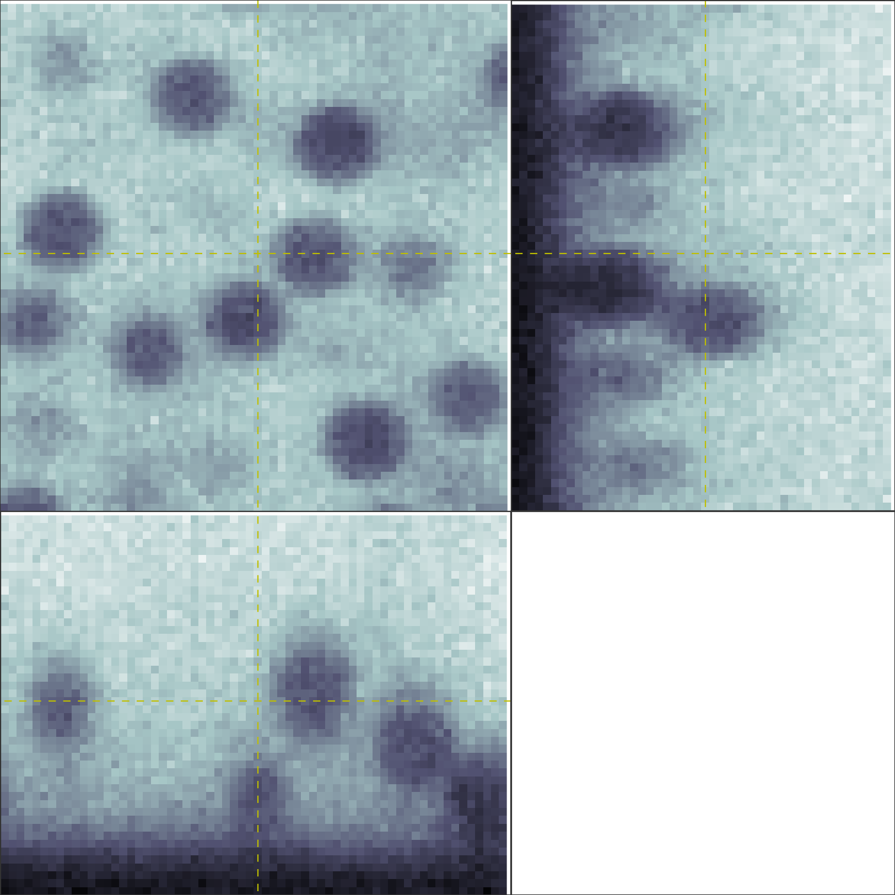
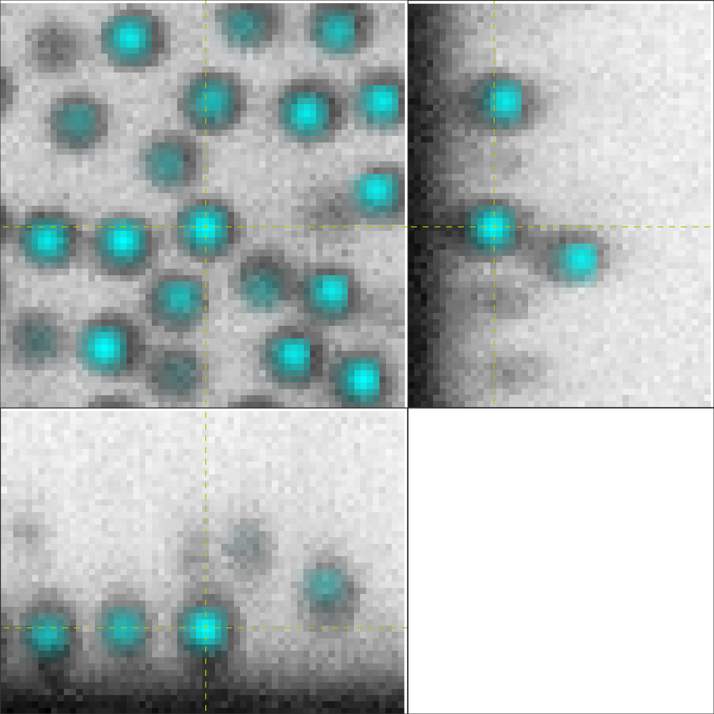
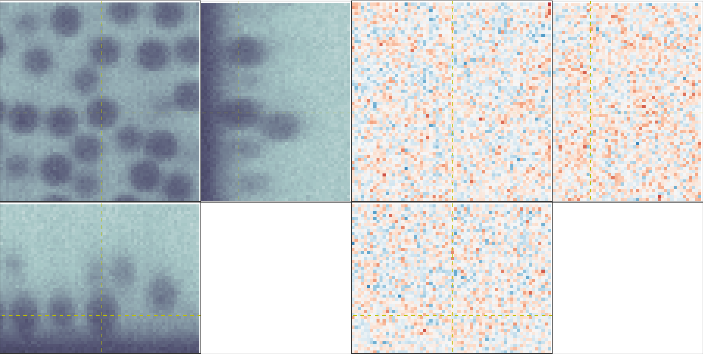
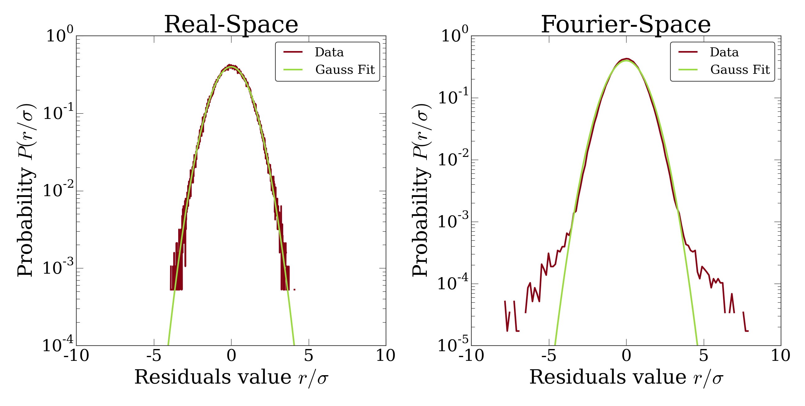

****************
PERI Walkthrough
****************

What is PERI?
-------------

PERI is a general, methodological framework to extract the maximum amount of
information from a single microscope image. The idea of PERI is simple and
short:

1. `Take a microscope image.`_
2. `Create a mathematical model of the image formation process.`_
3. `Fit that mathematical model to the image.`_
4. `If the fit is not good, improve the mathematical model.`_
5. `If the fit is good, use the extracted information from the fit.`_

The Python package ``peri`` contains both a general implementation of this
framework and a detailed implementation of it for confocal images. In this
walkthrough, I'll show you how to use the Python ``peri`` package to start from
an image and extract the maximal possible information from it. I'll demonstrate
this process on a real image from a confocal microscope, explaining each step
along the way but trying to avoid getting mired in details. Finally, I'll show
you some convenience functions implemented in ``peri`` that make this process
faster, both for you and your computer.

Before you begin, you'll need to install ``peri``. See the :doc:`Installation
</installation>` section for how to do this.

Take a microscope image.
------------------------
This is all you. A word to the wise though -- analysis with ``peri`` takes time
(step 3), and figuring out what the best mathematical model is (steps 2 and 4)
takes even more time. You can save a lot of time by taking the cleanest
possible data and avoiding as many imaging artifacts as possible.

We'll start by loading a small demo image with the package ``peri``. First,
:download:`download my test image <./_static/small_confocal_image.tif>`.
Then, open your Python interpreter and type:

.. code-block:: python

    from peri import util
    im = util.RawImage('small_confocal_image.tif')

This creates an object which contains rescaled raw data and allows for small
manipulations of the image by ``peri``. If you'd like to look at the image
interactively, you can use the :class:`~peri.viz.interaction.OrthoViewer`.

.. code-block:: python

    from peri.viz.interaction import OrthoViewer
    OrthoViewer(im.get_image())

This will pull up an image like the one below, showing three orthogonal views
of the three-dimensional tiffstack. Clicking on one of these will recenter the
views on the region you clicked.

Create a mathematical model of the image formation process.
-----------------------------------------------------------

The method PERI needs a mathematical model to reconstruct the experimental
image. At the grossest level, the model needs to create a model image.
This model also needs to have parameters (e.g. the positions of the particles
or the properties of the microscope) which are adjustable. PERI then fits
those parameters to find the best-possible model of the experimental image.

In the package ``peri``, the mathematical model itself is split into two parts:
the *components* of the model, and the *interaction* between those components
to create a final image. A component of the model is a description of a
physical property of the sample or microscope -- for instance, the
distribution :math:`\Pi` of fluorescent dye in the image or the intensity
:math:`I` of the light source. In addition, we need to know how these
components interact mathematically to form a model image -- e.g. the dye gets
illuminated by the light as :math:`I\times \Pi`.

Let's do a concrete example with our image above.

First, we need to figure out what components form our model.

Looking at the image, we see that the sample is composed of a coverslip slide
and a lot of spheres. We can start by creating those objects with an initial
guess for the :download:`particle positions <./_static/particle-positions.npy>`
and the following code:

.. code-block:: python

    import numpy
    from peri.comp import objs
    coverslip = objs.Slab(zpos=6)
    particle_positions = numpy.load('particle-positions.npy')
    particle_radii = 5.0  # a good guess for the particle radii, in pixels
    particles = objs.PlatonicSpheresCollection(particle_positions, particle_radii)

All the model components in ``peri`` are stored in the module ``peri.comp``.
The components describing the microscope sample being imaged are stored in
``peri.comp.objs``, which we import in the first line. In the next line, we
create a coverslip, which is described by a :class:`peri.comp.objs.Slab`
object. Finally, in the last line we create a collection of spheres, described
by :class:`peri.comp.objs.PlatonicSpheresCollection`.

To speed up ``peri`` 's fit of the model, I've created both of these objects
with reasonable initial guesses for the objects' parameters. By looking at the
raw image, I've seen that the coverslip is positioned at a height of roughly
z=6 pixels above the bottom of the image. If I wanted, I could also pass a
selection of Euler angles to describe the coverslip's orientation. However, a
flat coverslip is a good enough initial guess. Likewise, I've used a centroid
algorithm (trackpy) to do a reasonable job finding most of the spheres in the
image; the position guess for this is saved as ``'particle-positions.npy'``
[1]_. You can check the quality of this initial guess with the
:class:`~peri.viz.interaction.OrthoPrefeature`, which overlays the image with
the extracted particle positions:

.. code-block:: python

    from peri.viz.interaction import OrthoPrefeature
    OrthoPrefeature(im.get_image(), particle_positions, viewrad=3.0)

   Click around to look at particles! If you like, you can add or remove
   particles by hitting ``A`` or ``R``.

Clicking around shows that we've gotten most of the particles with our initial
featuring, which is really all that ``peri`` needs to start. Finally, by
looking at the raw data I've noticed that the particle radii are all about 5
pixels.

.. [1] If and when you're analyzing your own confocal images of spheres you can
   pass your initial guess for the positions as an [N,3] numpy.ndarray, which
   you can get however your heart desires, including through
   :func:`~peri.runner.locate_spheres`.

Looking at the image, we see that the coverslip and particles behave the same
way -- both exclude dye from regions of the image. Thus, it seems best to treat
these two objects together when we make our mathematical model, rather then
separately. We can do this by grouping these two objects together:

.. code-block:: python

    from peri.comp import comp
    objects = comp.ComponentCollection([particles, coverslip], category='obj')

A group of any model components is described by a
:class:`peri.comp.ComponentCollection`. Since we've collected these components
together, we describe them (``category='obj'``) so ``peri`` can identify to
which part of the model they belong.

Next, we see that the image is illuminated by a laser, with stripe-like
imperfections. We can create this object with this snippet:

.. code-block:: python

    from peri.comp import ilms
    illumination = ilms.BarnesStreakLegPoly2P1D(npts=(16, 10, 8, 4), zorder=8)

Mathematically, we can describe the illumination as some sort of continuous
field defined over the image. These field-like descriptions are stored in the
module :mod:`peri.comp.ilms`, which we import in the first line. A quick look at
the module shows that there are a sizeable number of possible illumination
field descriptions. All of these conceptually do the same thing, but they are
each parameterized slightly differently. After a lot of experimentation, I've
found that the streaky-structure in my image is well-described by the
technical-sounding BarnesStreakLegPoly2P1D [2]_. In general, the different
options in the ilms module are ways to parameterize the illumination, but they
each need to know how many parameters to use. For my microscope, I've found
that a good number of parameters for images of this size is what I've typed
in -- any less and the illumination isn't described sufficiently, and more is
overkill [3]_. You will *need* to figure out how many parameters to include for
your microscope and image size. For now, don't worry about this -- we'll go
over this in step 4.

.. [2] Briefly, this consists of a series of Barnes interpolants in the
   x-direction, each multiplied by a different Legendre polynomial in the
   y-direction, to create a 2D field in x & y. The 2D field in x&y is then
   multiplied by a second Legendre polynomial in z to create an illumination
   that varies in three-dimensions. If you have a stripey illumination in the
   x-direction then this is the illumination for you. If not, then no worries
   -- we discuss other options in the illumination section.
.. [3] If you want to know what these particular parameters mean -- the tuple
   ``npts`` is the number of points for each Barnes interpolant in each
   direction; the size of the tuple sets the order of the Legendre polynomial
   in y. The int ``zorder`` is the order of the Legendre polynomial in z.
   You can see the documentation for details.

In addition, from knowing my microscope I know that (1) there is a background
intensity always registered on the detector and (2) this background intensity
actually varies with position. We can describe this spatially-varying
background with the one-liner:

.. code-block:: python

    background = ilms.LegendrePoly2P1D(order=(7,2,2), category='bkg')

Since the background is just a spatially-varying field like the illumination,
I've described it with another representation of a field from the ilms module.
Here, the parameterization is as a 2D Legendre polynomial in x & y, and an
additional Legendre polynomial in z. However, to allow ``peri`` to distinguish
between the background and illumination components of the model, I've changed
the category of the background to 'bkg' [4]_. Finally, I've set the order
(number of parameters in the Legendre polynomials) to numbers that I've
empirically found work for me [5]_. In addition, for numerical reasons we
include an offset which takes into account high-frequency changes in the
background. We do this with:

.. code-block:: python

    from peri.comp import comp
    offset = comp.GlobalScalar(name='offset', value=0.)

.. [4] All the model components have categories; for most of the rest the
   default category is good enough for me.
.. [5] See the paper's supplemental information for details on why the numbers
   are what they are, in particular why the z-order is so large.

Finally, I can see that the image is blurry, due to the wave-nature of light
blurring out the image. We can describe this blurring with a point-spread
function:

.. code-block:: python

    from peri.comp import exactpsf
    point_spread_function = exactpsf.FixedSSChebLinePSF()

Representations of point-spread functions that use exact optical models are
stored in the :mod:`~peri.comp.exactpsf` module. I've chosen to describe my
image with an optical model of a line-scanning point-spread function (the
LinePSF bit), with some special numerical implementations made for speed and
reliability (the FixedSSCheb bit). If you don't want or need an exact optical
description of your point-spread function, then you can use one of the
heuristic functions stored in the module :mod:`peri.comp.psfs` (such as a
Gaussian or a Gaussian that changes in z).

Now that we have all the *components* of the mathematical model, we need to
describe how they *interact*. We do this by using the relationship for a
confocal image:

.. code-block:: python

    from peri import models
    model = models.ConfocalImageModel()

The model tells ``peri`` how to combine all the objects together to create an
image. Our :class:`~peri.models.ConfocalImageModel` knows that the objects in
the sample excludes dye from certain regions, the dye gets illuminated by a
laser, blurred by the point-spread function with microscope optics, and imaged
on a detector with a spatially-varying background. You can see what this model
mathematically is by typing

.. code-block:: python

    print model

Finally, we need to combine the mathematical model and its components together
to create a model image. In ``peri``, the image, the mathematical model, its
parameters and values, and the model image are all stored in an object called a
:class:`~peri.states.State` or :class:`~peri.states.ImageState`. We're now
ready to create our state:

.. code-block:: python

    from peri import states
    st = states.ImageState(im, [objects, illumination, background,
            point_spread_function, offset], mdl=model)

If we want to save our state or load a saved state, we can use
:func:`peri.states.save` and :func:`peri.states.load`. Finally, ``peri`` allows
the same parameter to describe multiple components of the model. For instance,
physically we know that the ratio of the z-pixel to xy-pixel size is the same
whether we're calculating an optical model of the point-spread function or
drawing the Platonic particles. We can link these parameters with

.. code-block:: python

    from peri import runner
    runner.link_zscale(st)

**this is a lie for two reasons. One, peri has trouble with non-psf stuff. Two,
is the zscale the same because of the difference between nominal and actual
focal positions? FIXME**

Fit that mathematical model to the image.
-----------------------------------------

Our state contains information about the quality of the fit through the
difference between the model and the image through two main attributes:
``st.residuals``, which returns the difference between the model image and the
experimental image, and ``st.error``, which returns the sum of the squares of
the residuals. Look at the error by typing

.. code-block:: python

    print st.error

Right now the fit's error is pretty bad. We can fit the state and improve the
error significantly using the convenience functions in :mod:`peri.runner`:

.. code-block:: python

    from peri import runner
    runner.optimize_from_initial(st)

This fits the state, printing information to your screen and saving progress
to your current directory along the way. If running this code doesn't fit the
state well enough, you can either re-run the code above again, or run:

.. code-block:: python

    runner.finish_state(st)

For a typical image, ``peri`` needs to fit thousands of parameters in a complex
landscape, which can take a lot of time. Be patient. Or better yet, leave your
computer and come back after lunch or tomorrow. If the convenience functions
don't work well for you or you want to delve into more details of the
optimization methods, you can read about them in the documentation's
:doc:`Optimization </optimization>` section, including how ``peri`` can
automatically add missing particles and remove bad ones.

If the fit is not good, improve the mathematical model.
-------------------------------------------------------

Now that we've fit our data, we need to check if the fit is good. ``peri``
provides several ways to do this for a single state. The first step is the
:class:`~peri.viz.interaction.OrthoManipulator`:

.. code-block:: python

    from peri.viz.interaction import OrthoManipulator
    OrthoManipulator(st)

This will pull up an interactive viewer which allows you to examine the raw
data, model image, fit residuals, and the different components of the model.
Hit ``Q`` to cycle through the diffferent view modes, and click on a particular
region in the image to see the orthogonal cross-sections of these modes. If you
see structure in the residuals of your fit -- shadows of particles or stripes
and long-wavelength variation in the residuals -- then your model isn't
complete or your fit isn't the best. For my state, we see that the fit is
pretty good, as you can see below.

   The :class:`~peri.viz.interaction.OrthoManipulator`. You can see the raw
   data on the left and the fit residuals on the right. The residuals are
   almost perfect Gaussian white noise.

You can look closer for structure in the residuals by looking at the Fourier
transform of the residuals (hit ``W``). Again, if you see structure in the
residuals in Fourier space, your model isn't complete or your fit isn't the
best.

If the residuals look OK by eye, check their distribution and deviation from
gaussianity. You can do this quickly with

.. code-block:: python

    from peri.viz import plots
    plots.examine_unexplained_noise(st)

This will bring up a figure that plots the distribution of residuals in real
and Fourier space and compares them with a normal distribution expected from
the variance of the residuals. If you see significant deviation of the data
from a Gaussian, then your model isn't complete or your fit isn't good.

    The distribution of residuals in real and Fourier space. They should be
    perfect Gaussians. While the distribution of real-space residuals is an
    amazingly perfect Gaussian, there are some deviations in Fourier space at
    large :math:`x/\sigma`. Looking at the
    :class:`~peri.viz.interaction.OrthoManipulator`, these arise from a
    combination of scanning noise on our detector (some lines at
    :math:`q_x=0, q_z=0`) and from incompleteness in our model (a faint ring at
    moderate :math:`q` values).

What should you do if the fit is bad? First, I would try more optimizations of
the state. If you optimize the state and the error changes, then you weren't at
the best-fit. Keep optimizing until the error stops changing and check again.

If the error doesn't decrease on optimization and the fit still isn't good,
then your model is incomplete. There are a few possibilities for an incomplete
model: (a) you've picked the right component, but with the wrong parameters or
amount of parameters, (b) you've picked the wrong component, (c) the
mathematical relationship between the components is incorrect.

Fixing (a) is easy. If you've realized that, say, your illumination isn't high
enough order, then just type something like this:

.. code-block:: python

    old_ilm = st.get('ilm')
    new_ilm = ilms.BarnesStreakLegPoly2P1D(npts=(50,40,20, 20, 20), zorder=7)  # or whatever works
    st.set('ilm', new_ilm)

You'll then need to re-optimize the state all over again. For some components
like the illumination and background, you can speed this up a bit by fitting
the new component before you continue optimizing, as described in the section
on :doc:`Optimization </optimization>`:

.. code-block:: python

    import peri.opt.optimize as opt
    opt.fit_comp(new_ilm, old_ilm)

but you'll still need to re-optimize the state as before.

Fixing problems (b) and (c) are usually just as easy. Say you realized that
your microscope is a point scanner and not a line scanning confocal. Just type:

.. code-block:: python

    new_psf = exactpsf.FixedSSChebPinholePSF()
    st.set('psf', new_psf)

Likewise, say you used the wrong model. (Perhaps your particles are dyed and
not the fluid.) Type

.. code-block:: python

    new_model = models.ConfocalDyedParticlesModel()  # or whatever model is best
    st.set_model(new_model)

Again, you'll need to re-optimize your state. You might be able to speed the
second optimization up by optimizing certain parts first; see the
:doc:`Optimization </optimization>` section for how to do this.

Sometimes, however, the component or model you need isn't included in the
``peri`` package. For instance, you could be imaging rods on a 4Pi microscope
or with STEM, changing your objects, point-spread function and image formation
model to things that aren't currently included in the ``peri`` package.
If this is the case, you'll need to develop ``peri`` to include a new model or
component! See the developer's section of the documentation to get started.

The quality of the data analysis that ``peri`` returns is directly related to
the quality of the generative model that you use. If your model is not a good
description of the data, then the parameters extracted from the model won't be
accurate. Thus it's very important to ensure that your model accurately
describes your experimental images. To ensure that the model is accurate, we've
found that it's best to construct the model in a systematic way. For instance,
for our confocal images we started by taking a blank image with the laser off,
as a way to measure our background intensity. Next we measure and fit an image
of just fluorescent dye, to describe our illumination correctly. Then we add
a slab, then particles. We've provided a stripped-down version of this as a
demo in scripts/test_genmodel.py. You should follow a similar protocol for your
image formation model.

If the fit is good, use the extracted information from the fit.
---------------------------------------------------------------

The :class:`~peri.states.ImageState` contains all the fitted parameters from
the image and their values. The parameters are named with human-readable names
that describe briefly which component and/or what the parameter describes.

You can get the parameters and values by typing

.. code-block:: python

    print st.params
    print st.values

which will print a very long list of all the state's parameters and values.
Usually this isn't the best format to access the data. Instead, if you want a
set of values for a certain set of parameters, use the ``get_values`` method.
For instance, if I want to know the radius ``a`` of the 13th sphere or the
fitted wavelength of the laser light from the point-spread function, I can
type:

.. code-block:: python

    print st.get_values('sph-13-a')  # 13th particle's radius, counting from 0
    print st.get_values('psf-laser-wavelength')  # psf's fitted laser wavelength

In addition, there are several convenience functions. You can get all the
positions or radii of all the particles in the state through these commands:

.. code-block:: python

    pos = st.obj_get_positions()
    rad = st.obj_get_radii()

These will return information on *all* the particles in the state, including
ones fit to be outside the image! You can select only the particles inside an
image by using :func:`peri.test.analyze.good_particles`, which will return a
Boolean mask that is True for particles inside the image and False for those
outside. The :mod:`~peri.test.analyze` module has many other useful things for
analyzing data, such as ways to calculate the packing fraction of the state and
ways to save and load states as rapidly-loadable json files.

Making this faster
------------------
Now that we have a completely-featured image, there is no point in repeating
the tedium above to find the best positions and radii for the next image in
your data. You can shortcut a lot of the human time by using some of the
convenience functions in :mod:`peri.runner`.

All of these ``runner`` functions allow you to select the images and
previously-featured states interactively through dialog boxes, for convenience.
If this is not convenient you can instead pass the filenames for the states
and images directly to the runner functions, along with a whole lot more
options. Read the documentation if you want to know more!

Here's how to feature an image quickly...

...using the microscope parameters from another state
~~~~~~~~~~~~~~~~~~~~~~~~~~~~~~~~~~~~~~~~~~~~~~~~~~~~~

You've already featured a few images from your dataset and have a good
``peri`` state for your microscope. You don't want to spend a ton of time
re-featuring the microscope parameters again; you just want the positions in
the next image. If the particles in the new image have a radius of roughly
5 pixels, run

.. code-block:: python

    runner.get_particles_featuring(5)

This will pull up a file dialog box asking you to select the image to feature
and the previously-featured state to take the microscope parameters from.
Once you've done this, it will run on its own and save the state to the same
directory as the image.

...using the microscope parameters and positions from another state
~~~~~~~~~~~~~~~~~~~~~~~~~~~~~~~~~~~~~~~~~~~~~~~~~~~~~~~~~~~~~~~~~~~

If the particles haven't moved by a whole lot from one frame in your dataset
to the next, then you can use

.. code-block:: python

    runner.translate_featuring()

which also allows for you to select the image through dialog boxes.

...from scratch
~~~~~~~~~~~~~~~
The ``runner`` functions also allow for featuring images from scratch, without
having a previously featured state. However, you'll need to write and supply a
statemaker function that makes a complete ``ImageState``. The statemaker
function needs to provide a model that can accurately describe your microscope
image formation. See the ``runner`` documentation or the example statemaker
in scripts/statemaker_example.py for details. To feature an image of dark
spherical particles with a radius of roughly 5 pixels on a bright background,
type:

.. code-block:: python

    runner.get_initial_featuring(statemaker, 5)

where ``statemaker`` is the statemaker function. You'll select the image
through dialog boxes.

...from a guess of positions and radii
~~~~~~~~~~~~~~~~~~~~~~~~~~~~~~~~~~~~~~

Perhaps you've already spent a lot of time with another method and have a
pretty good guess for all the particle positions and radii. In that case, run

.. code-block:: python

    runner.feature_from_pos_rad(statemaker, pos, rad)

Once again, you'll need a statemaker function. You will be able to select the
image through dialog boxes.

Checking your model even more
-----------------------------

Once you have multiple images featured, you can check the quality of your model
even more by looking at the variation of parameters from image to image. If
your model is truly exact and you are truly at the best-possible fit, then the
fitted parameters shouldn't change from image to image except for the tiny
amount of the Cramer-Rao bound. However, if your model is incomplete, the
systematic effects missing from the model will couple to the effects included
in the model, and small changes in the image (e.g. particles shifting) will
cause changes in the fitted parameters abover the Cramer-Rao bound. For our
confocal images of spheres, we've found that checking the radii variation from
frame-to-frame in a movie of freely-diffusing particles is a stringent test of
the quality of the fit and model. This is implemented in
:func:`peri.test.track.calculate_state_radii_fluctuations`, which uses the
`trackpy <http://soft-matter.github.io/trackpy/v0.3.2/>`_ package.
